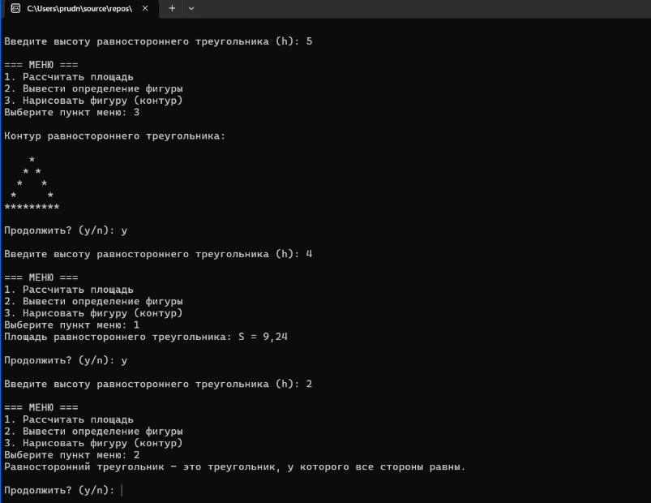

# Домашнее задание к работе 18
## Условие задачи
Составьте программу, которая для заданной пользователем фигуры, например прямоугольника (треугольника или другой фигуры см. инидивидуальное задание работы 9) предлагает меню выбора одной из операций:

рассчитать площадь;
вывести определение фигуры;
нарисовать фигуру.

### Алгоритм
Начало программы
Ввод данных пользователем:
h — высота вписанной окружности
Показать меню действий:
Рассчитать площадь — вызвать функцию S(r, a)
Вывести определение фигуры
Нарисовать треугольник — вызвать draw_deltoid(r)
Выйти из программы
Спросить, хочет ли пользователь продолжить
Если нет — завершить программу
Конец программы
### Блок-схема

## 2. Реализация программы:
#define _CRT_SECURE_NO_WARNINGS
#define _USE_MATH_DEFINES
#include <locale.h>
#include <stdio.h>
#include <stdlib.h>
#include <conio.h>
#include <math.h>

// Площадь равностороннего треугольника через высоту
float S_triangle(float h) {
    float a = 2 * h / sqrt(3);
    return (sqrt(3) / 4) * a * a;
}

// Контур треугольника (по умолчанию)
void draw_triangle_outline(int h) {
    for (int i = 1; i <= h; i++) {

        for (int j = 1; j <= h - i; j++)
            printf(" ");

        for (int j = 1; j <= 2 * i - 1; j++) {
            if (j == 1 || j == 2 * i - 1 || i == h)
                printf("*");
            else
                printf(" ");
        }
        printf("\n");
    }
}

int main() {
    setlocale(LC_ALL, "RUS");

    int choice;
    int h;

    while (1) {
        printf("\nВведите высоту равностороннего треугольника (h): ");
        scanf("%d", &h);

        printf("\n=== МЕНЮ ===\n");
        printf("1. Рассчитать площадь\n");
        printf("2. Вывести определение фигуры\n");
        printf("3. Нарисовать фигуру (контур)\n");

        printf("Выберите пункт меню: ");
        scanf("%d", &choice);

        switch (choice) {
        case 1:
            printf("Площадь равностороннего треугольника: S = %.2f\n", S_triangle(h));
            break;

        case 2:
            printf("Равносторонний треугольник — это треугольник, у которого все стороны равны.\n");
            break;

        case 3:
            printf("\nКонтур равностороннего треугольника:\n\n");
            draw_triangle_outline(h);
            break;

        default:
            printf("Неверный выбор. Попробуйте снова.\n");
        }

        printf("\nПродолжить? (y/n): ");
        char cont;
        scanf(" %c", &cont);
        if (cont == 'n' || cont == 'N') break;
    }

    return 0;
}
## 3. Результат работы программы

## 4. Информация о разработчике
Амелина Юлия, бИПТ-252
